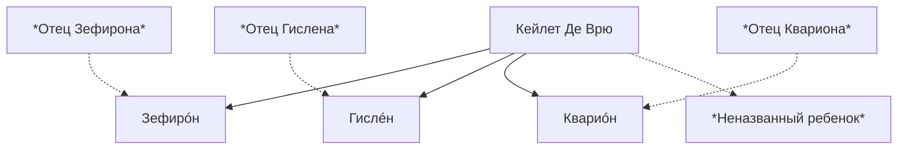

Де Врю — родовая фамилия семьи артистов, основавщих одноименную цирковую труппу.

Известные носители фамилии:

- [[Кейлет Де Врю]], основательница рода
- Первое поколение:
  - [[Зефирон]]
  - [[Гислен]]
  - [[Кварион]]
  - [[Младший Де Врю]]

# Родовое древо

# Слухи

- Семья основана около 1340 года.
